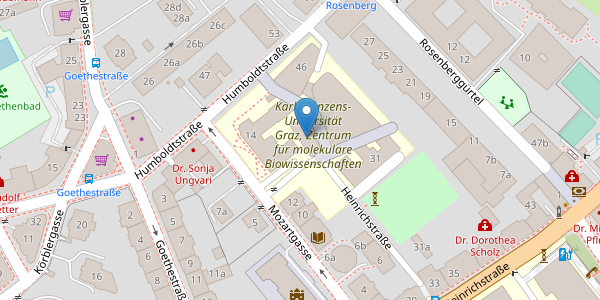

# OER-Infrastruktur-Barcamp 
      
## Veranstaltungsinfo
Wie könnte und sollte Infrastruktur für Open Educational Resources (OER) an unseren Hochschulen aussehen?   

Welche Erwartungen an OER-Repositories (und OER-Suchportale) sind vernünftig, welche Hoffnungen sind berechtigt?    

Sind die derzeitigen Bestrebungen auf dem richtigen Weg? Und wenn ja: ist es noch weit? 

## Ziel der Veranstaltung
Im Rahmen dieses Barcamps zum Dachthema "OER-Infrastruktur" möchten wir gegenseitig Einblick in aktuelle Infrastrukturprojekte ermöglichen und gemeinsam Fragen und Visionen diskutieren, die die technische und organisatorische Bereitstellung von OER betreffen. 

## Zielgruppe
Das Barcamp richtet sich an alle Admins und Manager_innen von OER-Repositorien, mit der Produktion und Distribution von OER befasste und daran interessierte Personen!

* * *
## Wann

 <iframe src="https://free.timeanddate.com/countdown/i88n9d4o/n318/cf12/cm0/cu4/ct0/cs1/ca0/co1/cr0/ss0/cac000/cpc000/pct/tcfff/fs100/szw448/szh189/tat22.April.2022/tac000/tptTime%20since%20Event%20started%20in/tpc000/iso2022-04-22T09:00:00/pl20/pr20" allowtransparency="true" frameborder="0" width="209" height="69"></iframe>

## Wo
<table style="width:100%">
  <tr>
    <td>Karl Franzens Universität Graz   
Universitätsplatz 3  
8010 Graz  
Genaue Informationen folgen..</td>
    <td></td>
  </tr>
</table>

  
[Universität Graz](https://www.uni-graz.at/) 

## Veranstalter
<table style="width:100%">
  <tr>
    <td></td>
    <td>Projekt Open Education Austria   
AP 2 "Lokale Repositorien aufbauen und weiterenwickeln"    </td>
  </tr>
</table>

[Open Education Austria](https://www.openeducation.at/)  ist ein Projekt österreichischer Universitäten zur gemeinsamen Entwicklung einer nationalen Infrastruktur für Open Educational Resources (OER).  

  
Projektteam:   
* Andreas Parschalk, BSc: Universität Innsbruck
* Mag. Julia Schindler: Universität Innsbruck
* Ing. Markus Schmid, BSc, MSc: Universität Innsbruck
* Mag. Dr. Michael Raunig: Universität Graz
* Stephan Lorbek, BSc: Universität Graz
  
## Kontakt und Anmeldung
[oer@uni-graz.at](mailto:oer@uni-graz.at)

